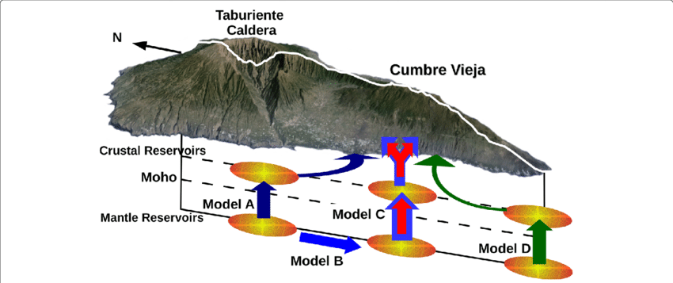

## Introduction

La Palma is one of the west most islands in the Volcanic Archipelago of the Canary Islands, a Spanish territory situated is the Atlantic Ocean where at their closest point are 100km from the African coast @fig-map. The island is one of the youngest, remains active and is still in the island forming stage.

](images/la-palma-map.png){#fig-map align="center" width="100%"}

La Palma has been constructed by various phases of volcanism, the most recent and currently active being the *Cumbre Vieja* volcano, a north-south volcanic ridge that constitutes the southern half of the island.

### Eruption History

A number of eruptions were recorded since the colonization of the islands by Europeans in the late 1400s, these are summarised in @tbl-history.

| Name      | Year |
| ----------- | ----------- |
| Current      | 2021       |
| Teneguía   | 1971        |
| Nambroque   | 1949        |
| El Charco   | 1712        |
| Volcán San Antonio   | 1677        |
| Volcán San Martin   | 1646        |
| Tajuya near El Paso   | 1585        |
| Montaña Quemada   | 1492        |

: Recent historic eruptions on La Palma {#tbl-history}

This equates to an eruption on average every 79 years up until the 1971 event. The probability of a future eruption can be modeled by a Poisson distribution @eq-poisson.

$$
p(x)=\frac{e^{-\lambda} \lambda^{x}}{x !}
$$ {#eq-poisson}

Where $\lambda$ is the number of eruptions per year, $\lambda=\frac{1}{79}$ in this case. The probability of a future eruption in the next $t$ years can be calculated by:

$$
p_e = 1-\mathrm{e}^{-t \lambda}
$$ {#eq-probability}

So following the 1971 eruption the probability of an eruption in the following 50 years — the period ending this year — was 0.469. After the event, the number of eruptions per year moves to $\lambda=\frac{1}{75}$ and the probability of a further eruption within the next 50 years (2022-2071) rises to 0.487 and in the next 100 years, this rises again to 0.736.

### Magma Reservoirs

Studies of the magma systems feeding the volcano, such as @marrero2019 has proposed that there are two main magma reservoirs feeding the Cumbre Vieja volcano; one in the mantle (30-40km depth) which charges and in turn feeds a shallower crustal reservoir (10-20km depth).

{#fig-reservoirs align="center" width="100%"}

In this paper, we look at recent seismicity data to see if we can see evidence of such a system action, see @fig-reservoirs.

## Dataset

The earthquake dataset used in our analysis was generated from the [IGN web portal](https://www.ign.es/web/resources/volcanologia/tproximos/canarias.html) this is public data released under a permissive license. A web scraping script was developed to pull data into a machine-readable form for analysis. That code tool [is available on GitHub](https://github.com/stevejpurves/ign-earthquake-data) along with a copy of recently updated data.

## Results

The dataset was loaded into a Jupyter notebook [visualization](./notebooks/figure-seaborn.ipynb) and filtered down to La Palma events only. This results in 5465 data points which we then visualized to understand their distributions spatially, by depth, by magnitude and in time.



From our analysis in @fig-timeline, we can see 3 different systems in play.

Firstly, the shallow earthquake swarm leading up to the eruption on 19th September, related to significant surface deformation and shallow magma intrusion.

After the eruption, continuous shallow seismicity started at 10-15km corresponding to magma movement in the crustal reservoir.

Subsequently, high magnitude events begin occurring at 30-40km depths corresponding to changes in the mantle reservoir. These are also continuous but occur with a lower frequency than in the crustal reservoir.

## Conclusions

From the analysis of the earthquake data collected and published by IGN for the period of 11 September through to 9 November 2021. Visualization of the earthquake events at different depths appears to confirm the presence of both mantle and crustal reservoirs as proposed by @marrero2019.

## Availability {.unnumbered}

A web scraping script was developed to pull data into a machine-readable form for analysis. That code tool [is available on GitHub](https://github.com/stevejpurves/ign-earthquake-data) along with a copy of recently updated data.

